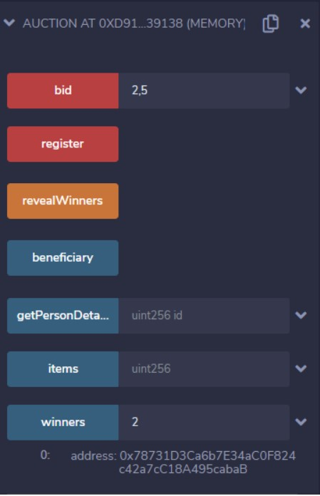

# Auction Smart Contract
A smart contract for auction system fund raising for a good cause. There is a chair person who hosts the auction and he can also bid. Users have to register on their own.Each user can buy fixed number of tokens which he can then bid on the listed items. At the end of the auction, the winner is decided for each item by the host.\
\
After the auction period ends the chairperson, checks the collection for each item and randomly selects a ticket from each item’s box to determine the winning bidder for that
item. The item is transferred to the winning bidder. Total money collected is the fundraised by the penny social auction.

## For simplicity -
1. Number of bidders = 4
2. Number of Items = 3
3. (All 0 indexed)

## To Run the code
1. Go [Remix Ethereum](http://remix.ethereum.org/#optimize=false&runs=200&evmVersion=null&version=soljson-v0.7.4+commit.3f05b770.js) website.
2. Upload the Auction.sol
3. Compile with 0.4.17 version
4. Deploy with JavaScript VM
5. Open under the deployed contract.
6. Interact with it as I have demonstrated in the attached video.Deployed Contract

## Deployed Image

